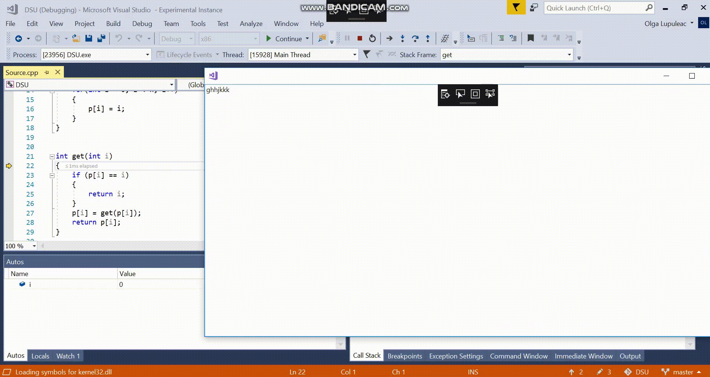

# Implementing a VS extension: text is sometimes typed in the code editor although my TextBox in WPF window has focus
I'm developing a Visual Studio extension for VS 2017 and I've created a custom command which opens a WPF window with a TextBox. Sometimes, when I'm trying to edit a text in the textbox, the changes appear in the code editor although the cursor is placed in the text box.
The bug cannot be reproduced deterministically, so the GIF with the bug is attached. 

To observe the bug with high probality:
1. Clone this repo. 
2. Build and run the extension (start a VS experimental instance).
3. Open a project which can be run under debugger and select a file with source code.
4. Start a debugger.
5. Select *Tools > Invoke OpenWindowCommand*. The WPF window with the text box will appear.
6. Enter some text in the text box.
7. Minimize the window.
8. Call 'Step into' several times.
9. Maximize the window. 
10. Try to edit a text in the text box.
11. Although a cursor is placed in the text box, a changes may appear in the code editor.

To reproduce the bug from scratch:
1. Create a VSIX project with the custom command, name it *OpenWindowCommand* https://docs.microsoft.com/en-us/visualstudio/extensibility/creating-an-extension-with-a-menu-command?view=vs-2019
2. Add *PresentationCore* and *PresentationFramework* assemblies as references to the project.  
3. Add this line `private Window _window = new Window {Content = new TextBox()};` to *OpenWindowCommand* class.
4. Change the code of the `Execute` method inside *OpenWindowCommand* to the following:

```c#
private void Execute(object sender, EventArgs e)
{
    ThreadHelper.ThrowIfNotOnUIThread();
     _window.Show();
}
```
5. Repeat the steps 2-11 from the previous instruction. 


